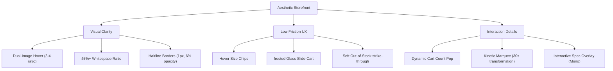

# Clothing E-Commerce Design & Aesthetics Playbook

This document is a unified, codified reference guide for high-end **Clothing E-Commerce Web Design**, modeled after the **Power Design** system. It contains the **20 Codified Design Principles** of premium apparel shopping and the complete **Brand DNA Profiles** for five iconic design directions (**Aimé Leon Dore**, **Fear of God**, **Kith**, **Arc'teryx**, and **Daily Drip**).

---

## PART 1: The 20 Codified Design Principles

These 20 concrete, measurable rules dictate the layouts, interactions, typography, and visual systems of world-class clothing e-commerce websites.



### Section 1: Visual Composition & Layout

1. **The Dual-Image Product Card (Hover Cross-Fade)**
   - **Rule**: Every product card in a catalog grid MUST display a flat-lay (garment-only) photo on load, and seamlessly morph/cross-fade (`transition: opacity 250ms cubic-bezier(0.4, 0, 0.2, 1)`) into a model fit/editorial photo on pointer hover.
   - **Rationale**: Humans buy clothing to see how it fits a body, but browse to see the product details. Combining both reduces cognitive friction.

2. **Whitespace-to-Content Ratio (Grid Breathing)**
   - **Rule**: Product grids must maintain a minimum whitespace ratio of 45%. This is measured as the ratio of pixels containing only the background canvas color relative to the total viewport area. Grid gaps/gutters must be at least 32px.
   - **Rationale**: High-end fashion is defined by breathing room. High content density signals "bargain bin" discount shopping; low density signals premium exclusivity.

3. **Portrait Editorial Aspect Ratios**
   - **Rule**: All product catalog photography must maintain a strict 3:4 portrait aspect ratio (`aspect-ratio: 3 / 4`). Technical or macro detail cards may use a 1:1 square ratio (`aspect-ratio: 1 / 1`). Product photos must never be horizontal, landscape, or mixed aspect ratios within a single grid.
   - **Rationale**: Human bodies are vertical. 3:4 is the gold standard for luxury lookbooks, maximizing screen height to present full garments.

4. **Asymmetric Grid Spacing (The 62/38 Split)**
   - **Rule**: Double-wide promotional blocks or hero sliders must split the image and text using the Golden Ratio (61.8% image / 38.2% background content) or a Rule-of-Thirds split (66.6% / 33.3%). Never split a hero banner 50/50.
   - **Rationale**: Symmetrical splits are static and unengaging; asymmetric weight creates kinetic energy that pulls the eye across the canvas.

5. **Hairline Border Simplicity**
   - **Rule**: Grid lines, cards, and input borders must be hairline-thin (exactly 1px solid) and colored using neutral-soft opacities (`rgba(0,0,0,0.06)` or `rgba(255,255,255,0.08)`). Thick or high-contrast borders must be avoided.
   - **Rationale**: Borders exist to group, not to draw attention. Dark lines choke the light out of streetwear and lookbook photography.

### Section 2: Color, Light, & Contrast

6. **Canvas-Photography Color Sync**
   - **Rule**: The page background canvas color must match the ambient lighting temperature of the catalog photography. Cold/high-contrast studios require clean grays (`#F5F5F7` to `#FAFAFA`). Warm/grainy lookbooks require cream/parchment palettes (`#FDFBF7` to `#F7F4EB`).
   - **Rationale**: If the photo background is slightly warm and the page background is stark blue-white, the photo will look dirty, creating a jarring, unpolished edge.

7. **The 60-30-10 Color Scheme System**
   - **Rule**: Limit the UI color palette to exactly three roles: 60% dominant background neutral (canvas), 30% primary typography and structural lines (ink), and exactly 10% (or less) of a single saturated brand accent color reserved strictly for action CTAs (Add to Cart, Checkout).
   - **Rationale**: Keeping color highly sparse focuses attention on the clothing colors themselves. The brand accent becomes an interactive guidepost.

8. **Meaning Beyond Hue**
   - **Rule**: Color must never be the sole indicator of status (e.g. sale badges, stock warning). Pair red/green badges with high-contrast text or explicit labels (e.g., standard text tag "LOW STOCK" in uppercase tracking +0.1em).
   - **Rationale**: Matches WCAG 1.4.1 requirements and ensures the interface is accessible to color-blind shoppers (~8% of male users).

9. **Projector/Mobile-Resilient Contrast**
   - **Rule**: All body typography and size indicators must maintain a contrast ratio of at least 4.5:1 (AA standard) against the canvas. Primary headers should aim for 7:1 (AAA standard) to resist ambient light wash-out on low-end screens.
   - **Rationale**: Clothing sites are frequently browsed on mobile devices outdoors under strong sunlight; high contrast guarantees readability anywhere.

### Section 3: Typography & Text Layout

10. **The Two-Family Typography Cap**
    - **Rule**: A storefront must utilize a maximum of two font families: 1 Editorial Serif (or Heavy Grotesque Display) for headlines + 1 highly readable Sans-serif (or Monospace) for body copy, size selectors, pricing, and specs.
    - **Rationale**: Multiple type styles distract the eye, making the website look disjointed. Variable weights within two families offer plenty of hierarchy.

11. **Display vs. Functional Letter-Spacing**
    - **Rule**: Big display headings (≥40px) must have negative letter-spacing applied (`letter-spacing: -0.02em` to `-0.04em`). Small labels, price tags, and uppercase metadata (≤12px) must open their tracking (`letter-spacing: 0.1em` to `0.2em`).
    - **Rationale**: Tightening display type makes letters lock together into cohesive wordmarks; opening small labels keeps them highly legible at small sizes.

12. **Line-Height Bounds for Readability**
    - **Rule**: Body text (14px–18px) must use a line-height between 1.4 and 1.6. Large display headings (≥32px) must clamp line-height tightly between 1.05 and 1.2 to prevent sprawling lines.
    - **Rationale**: Too tight body text merges lines into dark stripes; too loose headline text disconnects the words from the same phrase.

13. **Technical Specs Monospace Overlay**
    - **Rule**: Any technical performance garment specifications (e.g. GSM weight, fabric composite, hydrophobic coatings) must be rendered in a strict monospace typeface, downsized to exactly 10px–11px, capitalized, and tracked by +0.15em.
    - **Rationale**: Monospace evokes diagnostics and utilitarian precision, visually reinforcing the technical features of technical/outdoors streetwear.

### Section 4: Interaction & Micro-UX

14. **Hover Size Chips Display**
    - **Rule**: Apparel catalog cards must reveal available size chips (`S`, `M`, `L`, `XL`) instantly on card pointer hover using a smooth Y-axis translation (`transform: translateY(-8px)` with opacity fade-in over 200ms).
    - **Rationale**: Allows immediate check of availability without forcing the shopper to click and wait for a separate product page load.

15. **Soft Out-of-Stock Indicators**
    - **Rule**: Out-of-stock sizes on product listings must not be deleted or hidden. Instead, they must remain visible but styled at exactly 30%–40% opacity with a diagonal 1px slash/strike-through running from bottom-left to top-right.
    - **Rationale**: Tells the user that the size was designed and existed, and allows them to sign up for notifications instead of assuming it was never offered.

16. **Dynamic Glassmorphic Navigation Header**
    - **Rule**: Sticky navigation headers must transition from 100% transparent on page load/hero overlap to a frosted glass state (`backdrop-filter: blur(12px) saturate(180%)`, background color opacity between 70% and 80%) once scrolled ≥80px from top.
    - **Rationale**: Retains the full-bleed beauty of visual hero imagery while keeping navigation highly accessible and legible over dark/busy catalog grids.

17. **Slide-Out Utility Side-Cart (The Drawer)**
    - **Rule**: Clicking "Cart" must trigger a slide-out cart drawer occupying exactly the right 400px–420px of the screen, paired with a dark backdrop mask (`rgba(0,0,0,0.5)`) fading in over 300ms. Never redirect to a standalone cart page.
    - **Rationale**: Keeps the checkout flow inline. Seamless shopping transitions increase conversion rates by keeping the customer on the product grid.

18. **The Kinetic Brand Loop (Infinite Marquee)**
    - **Rule**: Horizontal text marquee loops must run at a constant speed between 30 and 45 seconds per cycle, and must be hardware-accelerated using standard CSS transform variables (`transform: translate3d(0,0,0)`).
    - **Rationale**: Kinetic motion draws attention, but too fast motion causes reading fatigue. A gentle, sweeping pace keeps the site feeling alive.

19. **Dynamic Cart Badge Scale Pop**
    - **Rule**: When a product is added to the cart, the numeric item-count badge must perform a spring scale scaling up to exactly 1.25× before snapping back to 1.0× over exactly 200ms (`transform: scale(1.25)` to `scale(1)`).
    - **Rationale**: Provides satisfying, immediate tactile feedback that confirms a system reaction without using interruptive popup alerts.

20. **Seamless Form Inputs & Validation**
    - **Rule**: Checkout and drop email inputs must use standard CSS `:user-valid` and `:user-invalid` selectors. Green checkmark indicators or light validation glows must only trigger after focus blur—never flash error messages while the user is actively typing.
    - **Rationale**: Eliminates early-typing stress and form friction, providing a smooth, high-end shopping check.

---

## PART 2: The 5 Brand DNA Profiles

Here are the exact design systems for five contrasting brand archetypes, codified for implementation.

```
├── Aimé Leon Dore    --> Warm Heritage Prep (Editorial Serifs, Cream, Rich Green)
├── Fear of God       --> Minimal Luxury (Quiet Luxury, Sand, Off-Black, Stark Space)
├── Kith              --> Modern Streetwear (Hype/Drop,grotesque Sans, Stark Black/White)
├── Arc'teryx         --> Technical Outdoors (Gorpcore, Monospace specs, Safety Orange)
└── Daily Drip        --> Organic Sage Streetwear (Earth-Tone Sage, Charcoal, Fluid UX)
```

---

### Brand: Aimé Leon Dore
**Aesthetics Archetype**: Warm Heritage Prep (Classic New York Editorial)

```yaml
brand: Aimé Leon Dore
slug: aime-leon-dore
website: https://www.aimeleondore.com
description: |
  A deeply warm, nostalgic editorial design that feels like a vintage European apparel shop combined with Queens basketball heritage.
  Anchored on warm cream backgrounds (#FDFBF7) and rich forest greens, the brand uses classical serif typography (editorial serifs)
  with tight, boxed hairline borders. Photography features analog film grain, vintage lighting, and rich textures.
colors:
  primary: "#142c1d" # Rich Forest Green
  primary-light: "#1e422c"
  canvas: "#fdfbf7" # Warm Cream / Parchment
  ink: "#111111" # Off-black
  muted: "#5f6368"
  muted-soft: "#8c9096"
  hairline: "rgba(20, 44, 29, 0.08)"
  surface-card: "#ffffff"
  surface-soft: "#f7f5f0"
  on-primary: "#ffffff"
  accent: "#d4af37" # Brass Gold
typography:
  display-lg:
    fontFamily: "'Garamond', 'Didot', 'Playfair Display', serif"
    fontSize: 32px
    fontWeight: 500
    lineHeight: 1.15
    letterSpacing: "-0.01em"
  display-md:
    fontFamily: "'Garamond', serif"
    fontSize: 24px
    fontWeight: 500
    lineHeight: 1.2
    letterSpacing: "0"
  body-md:
    fontFamily: "'Inter', -apple-system, sans-serif"
    fontSize: 15px
    fontWeight: 400
    lineHeight: 1.5
    letterSpacing: "0.01em"
  caption:
    fontFamily: "'Inter', sans-serif"
    fontSize: 12px
    fontWeight: 500
    lineHeight: 1.3
    letterSpacing: "0.08em"
    textTransform: "uppercase"
rounded:
  none: "0px"
  sm: "2px"
spacing:
  xs: "8px"
  sm: "16px"
  md: "24px"
  lg: "32px"
  xl: "48px"
components:
  card:
    border: "1px solid var(--color-hairline)"
    borderRadius: "0px"
    padding: "16px"
  button:
    backgroundColor: "var(--color-primary)"
    textColor: "var(--color-on-primary)"
    borderRadius: "0px"
    padding: "12px 24px"
    textTransform: "uppercase"
    letterSpacing: "0.1em"
```

---

### Brand: Fear of God
**Aesthetics Archetype**: Minimal Luxury (The Quiet Luxury / High Fashion Canvas)

```yaml
brand: Fear of God
slug: fear-of-god
website: https://www.fearofgod.com
description: |
  Extreme minimalism, massive whitespace, and monochromatic earth tones (sand, oatmeal, charcoal).
  Typography is sparse, utilizing ultra-light geometric sans-serif fonts set in uppercase with extensive tracking.
  Photography is high-contrast, editorial, featuring full-bleed garments against stark sand studio backgrounds.
colors:
  primary: "#1c1b18" # Deep Charcoal
  canvas: "#eae6df" # Oatmeal / Sand
  ink: "#1c1b18"
  muted: "#7c776e"
  muted-soft: "#a8a297"
  hairline: "rgba(28, 27, 24, 0.06)"
  surface-card: "#eae6df"
  surface-soft: "#f2efe9"
  on-primary: "#ffffff"
  accent: "#1c1b18"
typography:
  display-lg:
    fontFamily: "'Outfit', 'Helvetica Neue', sans-serif"
    fontSize: 28px
    fontWeight: 300
    lineHeight: 1.1
    letterSpacing: "0.15em"
    textTransform: "uppercase"
  body-md:
    fontFamily: "'Outfit', sans-serif"
    fontSize: 13px
    fontWeight: 400
    lineHeight: 1.6
    letterSpacing: "0.05em"
  caption:
    fontFamily: "'Outfit', sans-serif"
    fontSize: 10px
    fontWeight: 500
    lineHeight: 1.2
    letterSpacing: "0.2em"
    textTransform: "uppercase"
rounded:
  none: "0px"
spacing:
  xs: "12px"
  sm: "24px"
  md: "36px"
  lg: "64px"
  xl: "96px"
components:
  card:
    border: "none"
    borderRadius: "0px"
    padding: "0px"
  button:
    backgroundColor: "transparent"
    border: "1px solid var(--color-primary)"
    textColor: "var(--color-primary)"
    borderRadius: "0px"
    padding: "16px 32px"
    textTransform: "uppercase"
    letterSpacing: "0.2em"
```

---

### Brand: Kith
**Aesthetics Archetype**: Modern Streetwear (The Drop & Hype Boxed Grid)

```yaml
brand: Kith
slug: kith
website: https://kith.com
description: |
  A grid-dominant, highly functional layout optimized for fast-paced catalog drops.
  Utilizes aggressive, tight grotesque/sans typography, high-contrast black and white palettes,
  and extensive metadata blocks. Visuals focus on heavy product details, size availability, and quick actions.
colors:
  primary: "#000000"
  canvas: "#ffffff"
  ink: "#000000"
  muted: "#555555"
  muted-soft: "#999999"
  hairline: "#e8e8e8"
  surface-card: "#ffffff"
  surface-soft: "#f9f9f9"
  on-primary: "#ffffff"
  accent: "#111111"
typography:
  display-lg:
    fontFamily: "'Helvetica Neue', 'Arial', sans-serif"
    fontSize: 24px
    fontWeight: 800
    lineHeight: 1.1
    letterSpacing: "-0.03em"
    textTransform: "uppercase"
  body-md:
    fontFamily: "'Helvetica Neue', sans-serif"
    fontSize: 14px
    fontWeight: 500
    lineHeight: 1.4
    letterSpacing: "-0.01em"
  caption:
    fontFamily: "'Helvetica Neue', sans-serif"
    fontSize: 11px
    fontWeight: 700
    lineHeight: 1.2
    letterSpacing: "0.05em"
    textTransform: "uppercase"
rounded:
  none: "0px"
  sm: "3px"
spacing:
  xs: "6px"
  sm: "12px"
  md: "20px"
  lg: "32px"
  xl: "56px"
components:
  card:
    border: "1px solid var(--color-hairline)"
    borderRadius: "3px"
    padding: "12px"
  button:
    backgroundColor: "var(--color-primary)"
    textColor: "var(--color-on-primary)"
    borderRadius: "3px"
    padding: "14px 20px"
    textTransform: "uppercase"
    letterSpacing: "0.05em"
```

---

### Brand: Arc'teryx
**Aesthetics Archetype**: Technical Outdoors (Utilitarian Gorpcore)

```yaml
brand: Arc'teryx
slug: arcteryx
website: https://arcteryx.com
description: |
  Utilitarian, clean, and extremely high-performance. Visualizes garment structure and material technology.
  Utilizes stark technical monospace typography, deep slate/charcoal backgrounds, neon safety highlights,
  and diagnostics lines. Grid is structured like a blueprints spec sheet.
colors:
  primary: "#141416" # Tech Slate Black
  canvas: "#0e0e0f" # Deep Charcoal
  ink: "#e4e4e7" # Zinc White
  muted: "#71717a"
  muted-soft: "#52525b"
  hairline: "rgba(228, 228, 231, 0.08)"
  surface-card: "#18181b"
  surface-soft: "#121213"
  on-primary: "#141416"
  accent: "#ff5a00" # Safety Neon Orange
typography:
  display-lg:
    fontFamily: "'Space Grotesk', -apple-system, sans-serif"
    fontSize: 26px
    fontWeight: 700
    lineHeight: 1.15
    letterSpacing: "-0.02em"
  body-md:
    fontFamily: "'Inter', sans-serif"
    fontSize: 14px
    fontWeight: 400
    lineHeight: 1.5
  caption:
    fontFamily: "'Space Mono', monospace"
    fontSize: 10px
    fontWeight: 600
    lineHeight: 1.2
    letterSpacing: "0.15em"
    textTransform: "uppercase"
rounded:
  none: "0px"
  sm: "4px"
  md: "8px"
spacing:
  xs: "8px"
  sm: "16px"
  md: "24px"
  lg: "40px"
  xl: "64px"
components:
  card:
    border: "1px solid var(--color-hairline)"
    borderRadius: "4px"
    padding: "16px"
  button:
    backgroundColor: "var(--color-accent)"
    textColor: "var(--color-on-primary)"
    borderRadius: "4px"
    padding: "14px 24px"
    textTransform: "uppercase"
    letterSpacing: "0.1em"
    fontWeight: 700
```

---

### Brand: Daily Drip
**Aesthetics Archetype**: Organic Sage Streetwear (The Fluid Earth-Tone Canvas)

```yaml
brand: Daily Drip
slug: daily-drip
website: https://github.com/nathandcook10/daily-drip
description: |
  A highly aesthetic, calm, and premium streetwear portal combining skateboarding culture with organic minimalism.
  Anchored on smooth off-white backgrounds, deep charcoal inks, and organic sage/forest green brand tones.
  Uses modern variable typography, beautiful glassmorphism scroll overlays, and fluid micro-transitions.
colors:
  primary: "#2d3e33" # Organic Sage Green
  primary-dark: "#1e2b23"
  canvas: "#f8f9f6" # Smooth Off-white
  ink: "#171a18" # Deep Forest Charcoal
  muted: "#5a615c"
  muted-soft: "#8fa395"
  hairline: "rgba(45, 62, 51, 0.08)"
  surface-card: "#ffffff"
  surface-soft: "#eff1eb"
  on-primary: "#ffffff"
  accent: "#1e5234" # Forest Pine Green
typography:
  display-lg:
    fontFamily: "'Outfit', 'Inter', sans-serif"
    fontSize: 28px
    fontWeight: 700
    lineHeight: 1.2
    letterSpacing: "-0.02em"
  body-md:
    fontFamily: "'Inter', sans-serif"
    fontSize: 15px
    fontWeight: 400
    lineHeight: 1.55
  caption:
    fontFamily: "'Outfit', sans-serif"
    fontSize: 11px
    fontWeight: 600
    lineHeight: 1.2
    letterSpacing: "0.12em"
    textTransform: "uppercase"
rounded:
  xs: "4px"
  sm: "8px"
  md: "16px"
  full: "9999px"
spacing:
  xs: "8px"
  sm: "16px"
  md: "24px"
  lg: "36px"
  xl: "64px"
components:
  card:
    border: "none"
    borderRadius: "16px"
    backgroundColor: "var(--color-surface-card)"
    boxShadow: "0 4px 20px rgba(0,0,0,0.02)"
  button:
    backgroundColor: "var(--color-primary)"
    textColor: "var(--color-on-primary)"
    borderRadius: "9999px"
    padding: "14px 28px"
    letterSpacing: "0.05em"
    fontWeight: 600
    transition: "all 0.25s cubic-bezier(0.4, 0, 0.2, 1)"
```

---

## PART 3: The Interactive Theme Switcher

To allow Alby and Nathan to rapidly test these designs on the storefront, these variable presets are compiled into ready-to-use CSS stylesheets in the `/themes` folder, which can be linked dynamically or loaded into `global.css`.

To activate a brand theme in your React code, simply import the brand class onto the root HTML element:

```jsx
// Example to set ALD theme
document.documentElement.className = 'theme-aime-leon-dore';
```

Every component utilizes the same semantic variable mapping, guaranteeing that hotswapping the theme instantly rewrites the website visual universe.

---

*Playbook authored for The Daily Drip Catalog & Visual System — May 2026*
