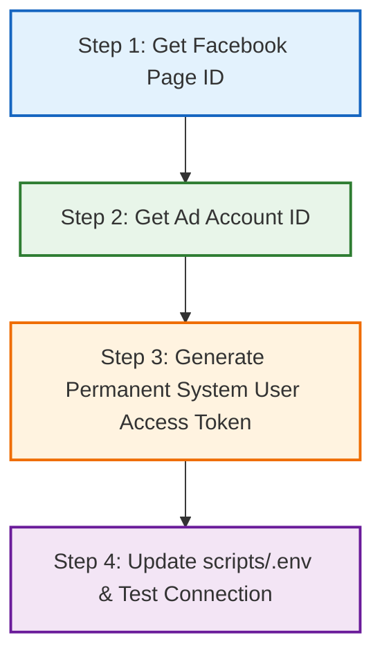

# 💧 Meta Ads Marketing API Integration Guide

This guide details the step-by-step process of configuring Meta Ads for **The Daily Drip** automation suite. 
By completing these steps, you will obtain the three necessary credentials to populate your local `scripts/.env` file:
1. `META_PAGE_ID` (Your brand's Facebook Page ID)
2. `META_AD_ACCOUNT_ID` (Your Ads Manager account ID)
3. `META_ACCESS_TOKEN` (A permanent System User Access Token)

---

## 📋 The 3-Step Setup Blueprint



---

## 🏷️ Step 1: Obtain Your Facebook Page ID (`META_PAGE_ID`)

Your automated ads need a Facebook Page to act as the "sender" of the advertisement on both Facebook and Instagram.

### How to Find it:
1. Go to your **Facebook Page**.
2. Click on the **About** tab.
3. Scroll down and click on **Page Transparency** or **Details**.
4. You will see a section showing your **Page ID** (a long string of digits, e.g., `104839281729384`).
5. *Alternative:* Go to [Meta Business Suite Settings](https://business.facebook.com/latest/settings) -> **Business assets** -> **Pages**, select your Page, and copy the ID from the panel.

Copy this number and paste it in `scripts/.env`:
```env
META_PAGE_ID=your_page_id_here
```

---

## 🎯 Step 2: Find Your Ad Account ID (`META_AD_ACCOUNT_ID`)

This ID tells the script where to create campaigns, manage budgets, and charge ad spends.

### How to Find it:
1. Open [Meta Ads Manager](https://adsmanager.facebook.com/).
2. Look at the top-left dropdown menu (where your account name is). Your Ad Account ID will be displayed next to the account name (e.g., `123456789012345`).
3. *Alternative:* Look at the URL bar in Ads Manager. Find the parameter that says `act=XXXXXXXXXXXXXXXX`. That number is your Ad Account ID.

> [!IMPORTANT]
> Meta's API expects the Ad Account ID to be prefixed with `act_` followed by the numeric ID. 
> Our Python code will automatically append it if it's missing, but it's best practice to write it as `act_XXXXXXXXXXXXXXXX`.

Copy this ID and paste it in `scripts/.env`:
```env
META_AD_ACCOUNT_ID=act_your_ad_account_id_here
```

---

## 🔑 Step 3: Generate a Permanent System User Token (`META_ACCESS_TOKEN`)

A standard access token expires in 2 hours or 60 days. Because our script runs headlessly via CLI, we need a **Permanent System User Access Token** that never expires.

### Phase A: Create a Meta Developer App
1. Go to [developers.facebook.com](https://developers.facebook.com/) and register or log in.
2. Click on **My Apps** in the top menu, then click **Create App**.
3. Select **Other** as the use case, then click **Next**.
4. Choose **Business** as the app type, then click **Next**.
5. Name your App (e.g., `Daily Drip Automation Suite`).
6. Select your **Meta Business Account** from the dropdown (this is required to access the Marketing API). Click **Create app**.
7. In the App Dashboard, scroll down to **Marketing API** and click **Set Up**.

### Phase B: Create a System User in Business Suite (Recommended for Permanent Tokens)
1. Navigate to your [Meta Business Settings](https://business.facebook.com/settings).
2. Ensure you have selected the correct Business Account.
3. In the left-hand sidebar, go to **Users** -> **System Users**.
4. Click **Add** to create a new System User.
5. Provide a name (e.g., `Daily Drip Bot`) and set the System User Role to **Admin**. Click **Create System User**.

### Phase C: Assign Assets & Generate the Token
1. On the same **System Users** page, click **Assign Assets** for your new user.
2. Grant full permission control to the System User for the following assets:
   * **Pages**: Select your Facebook Page -> Enable all options (full control).
   * **Ad Accounts**: Select your Ads Manager account -> Enable all options (full control).
   * **Apps**: Select the `Daily Drip Automation Suite` app you created.
   * Click **Save Changes**.
3. Now, click **Generate New Token**.
4. Select your `Daily Drip Automation Suite` App from the dropdown.
5. Check the following two critical permissions:
   * `ads_management` (allows creating campaigns, ad sets, creatives, and ads)
   * `ads_read` (allows verifying configurations and reading campaigns)
6. Click **Generate Token**.
7. **CRITICAL WARNING:** Copy this token immediately! Meta will only show it to you once. Keep it highly secure as it has permanent admin access to your ad account.

Copy this long token string and paste it in `scripts/.env`:
```env
META_ACCESS_TOKEN=EAAd...your_token_here
```

---

## ⚡ Step 4: Verification & Testing

Once your `scripts/.env` file is fully configured, let's run our verification suite to ensure the APIs can talk to Meta and Printify seamlessly!

### Run the Connection Test
Open your terminal inside the project directory and run:
```bash
python3 scripts/daily_drip_manager.py test
```

### Expected Output:
```text
💧 [Daily Drip Automation] Verifying API integrations...
⚡ Printify Token found. Initializing connection...
✅ Printify Success: Found 1 shop(s) connected.
   - The Daily Drip Store (ID: 26798522)
--------------------------------------------------
⚡ Meta Access Token and Ad Account found. Initializing connection...
✅ Meta Configuration Verified. Target Ad Account: act_your_ad_account_id_here
```

---

## 🚀 Pushing a Drop to Printify & Meta Ads

Once verified, you are fully set up to launch your daily drips! You can trigger the complete automation workflow by passing the design artwork and ad assets:

```bash
python3 scripts/daily_drip_manager.py create-drip \
  --title "Forest Sage Block Tee" \
  --desc "An organic Sage Green minimal block print representing growth and deep charcoal contrasts." \
  --design-url "https://raw.githubusercontent.com/nathandcook10/daily-drip/main/public/assets/forest_sage_print.png" \
  --mockup-path "/Users/nathan/Daily Drip/Core Art/forest_sage_mockup.png" \
  --price 34.00 \
  --budget 15.00 \
  --interests "Streetwear,Minimalist Fashion,Sustainable Apparel"
```

This single command will:
1. Upload your design to Printify.
2. Publish a high-end unisex Bella+Canvas t-shirt to Shopify/Printify.
3. Upload your beautiful ad mockup to Meta.
4. Program a targeted Campaign, Ad Set, Ad Creative, and Ad on Facebook & Instagram (fully configured, but **paused** for your safety and final visual review before spending budget).
